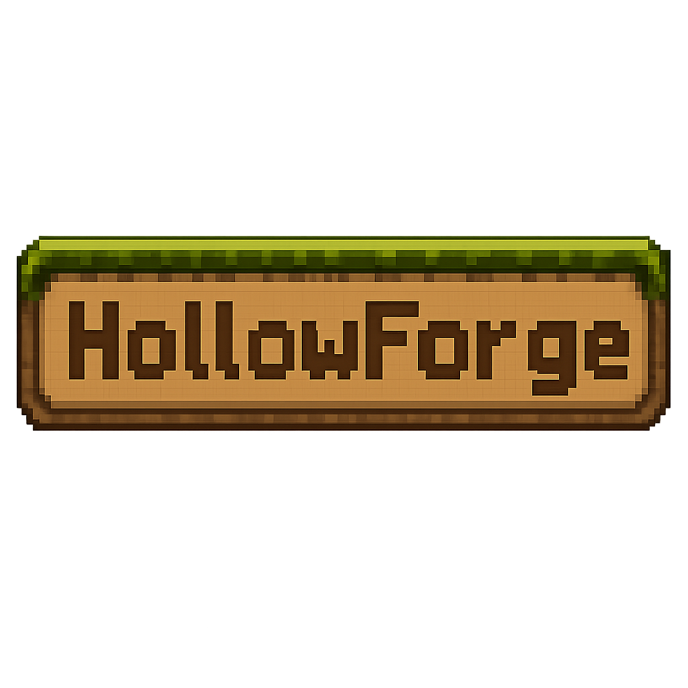

<p align="center"></p>

> RPG 2D Pixel Art open source desarrollado colaborativamente con JavaFX.

---

# 🌍 ¿Qué es HollowForge?

HollowForge es un videojuego RPG sandbox 2D inspirado en experiencias como Terraria, pero construido desde cero con un enfoque:

* educativo,
* colaborativo,
* modular,
* mantenible,
* y totalmente open source.

El proyecto se desarrolla públicamente junto a la comunidad.

No buscamos únicamente crear un videojuego. Buscamos construir:

* una comunidad,
* una experiencia de aprendizaje,
* un proyecto real de ingeniería de software,
* y una aventura colaborativa.

---

# ✨ Filosofía del Proyecto

Este repositorio prioriza:

✅ Código limpio

✅ Arquitectura mantenible

✅ Aprendizaje real

✅ Participación comunitaria

✅ Buenas prácticas

✅ Simplicidad antes que complejidad

---

# 🧱 Stack Tecnológico

| Área         | Tecnología |
| ------------ | ---------- |
| Lenguaje     | Java 25    |
| Renderizado  | JavaFX     |
| Build System | Maven      |
| Versionado   | Git        |
| Licencia     | MIT        |

---

# 📁 Estructura del proyecto

```
src/main/java/dev/hollowforge/
├── app/                  # Entry point (MainApp)
├── domain/               # 🧼 Clean Architecture
│   ├── entity/           #   PlayerStats, Inventory, Quest
│   └── usecase/          #   ApplyDamage, LevelUp
├── ecs/                  # 🎮 ECS + DOD
│   ├── component/        #   Position, Velocity, Health, Damage
│   ├── core/             #   EntityArray, ComponentChunk
│   └── system/           #   MovementSystem, CombatSystem, AISystem
├── engine/               # 🧱 Runtime
│   ├── audio/            #   AudioManager
│   ├── config/           #   AppConstants
│   ├── core/             #   GameLoop
│   ├── game/             #   GameController
│   ├── navigation/       #   SceneManager
│   └── rendering/        #   GameView
├── presentation/         # 🖥 UI del juego
│   └── ui/               #   MainMenu, Options, PauseMenu, ContributorsView
│       └── components/   #   UIButtonFactory, ImageBackground, FontLoader
├── infrastructure/       # 🔌 Integraciones externas
│   ├── external/github/  #   GitHubService, Contributor DTO
│   └── logging/          #   LogManager
└── shared/               # 📦 Utilidades genéricas
    └── util/             #   BrowserUtil
```

---

# 🚀 Cómo ejecutar

```bash
# Requisitos: JDK 25 + Maven 3.x

cd src/
mvn clean compile    # Compilar
mvn javafx:run       # Ejecutar
```

Clase principal: `dev.hollowforge.app.MainApp`

---

# 🎮 Características implementadas

- [x] Menú principal con fondo y botones
- [x] Música de fondo con fade in/out
- [x] Menú de opciones (volumen)
- [x] Vista de contribuidores desde GitHub API
- [x] Menú de pausa durante la partida
- [x] Game loop con delta time
- [x] Arquitectura por capas (domain, ecs, engine, presentation, infrastructure)
- [x] Entidades de dominio (PlayerStats, Inventory, Quest)
- [x] Componentes ECS (Position, Velocity, Health, Damage)
- [x] Sistemas ECS (MovementSystem, CombatSystem, AISystem)
- [ ] Mundo procedural
- [ ] Combate real
- [ ] Inventario con UI
- [ ] Enemigos
- [ ] Crafting

---

# 📚 Documentación

| Documento | Descripción |
|-----------|-------------|
| [COMPLETE_REFERENCE.md](docs/COMPLETE_REFERENCE.md) | **Referencia técnica completa** (10 secciones: introducción, arquitectura, GitFlow, estructura, convenciones, issues, CI/CD, versionado, agent plan, conclusión) |
| [ARCHITECTURE.MD](docs/ARCHITECTURE.MD) | Arquitectura del sistema, capas y dependencias |
| [GITFLOW.md](docs/GITFLOW.md) | Flujo de trabajo Git y convención de commits |
| [AGENT_PLAN.md](docs/AGENT_PLAN.md) | Mapeo plan vs implementación actual |
| [CONTRIBUTING.md](docs/CONTRIBUTING.md) | Guía de contribución |
| [STYLEGUIDE.md](docs/STYLEGUIDE.md) | Guía de estilo de código |
| [ROADMAP.md](docs/ROADMAP.md) | Roadmap de desarrollo |

---

# 🛠️ Estado Actual

> **Fase 0 — Fundación (~85% completa)**
>
> Arquitectura implementada. Esqueleto funcional con menús, audio y navegación.
> Pendiente: integrar ECS con el GameLoop y comenzar Fase 1 (Mundo Base).

---

# 🤝 ¿Cómo Contribuir?

Puedes contribuir mediante:

* código,
* pixel art,
* música,
* efectos de sonido,
* testing,
* documentación,
* traducciones,
* optimización,
* balancing,
* lore.

Lee [CONTRIBUTING.md](docs/CONTRIBUTING.md) antes de abrir un Pull Request.

---

# 📜 Licencia

Este proyecto utiliza la licencia MIT. Consulta el archivo LICENSE para más información.

---

# ⭐ Participa

Si te gusta el proyecto:

* deja una estrella ⭐
* contribuye 🛠️
* comparte ideas 💡
* aprende con nosotros 📚
